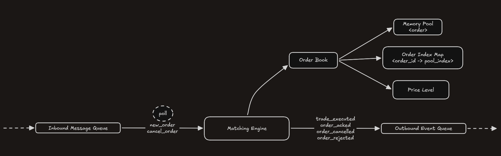
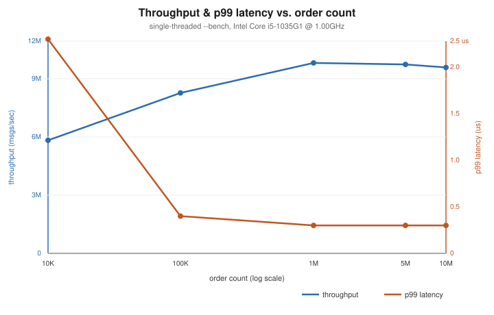

# Order Matching Engine

A single-symbol order book and matching engine in C++20, built around
price-time priority with fixed-capacity, allocation-free on the hot path,
and cache-conscious.

There's no dynamic memory allocation, no locks, and no STL containers on the
order-processing path. Orders live in a flat memory pool, price levels are
tracked with a bitmap for O(1) best-bid/ask lookup, and inbound/outbound
messages move through a lock-free single-producer/single-consumer queue.

## Architecture



`MatchingEngine::poll()` drains the inbound queue, dispatches each message to
the `OrderBook`, and pushes resulting `OutboundEvent`s onto the outbound queue.

## Building

```bash
./build.sh --clean
```

## Testing

```bash
./run_tests.sh
```

## Performance

Measured with `order_matching_engine --bench`.

| Metric | Value |
|---|---|
| p50 latency | 0.1 µs |
| p90 latency | 0.1 µs |
| p99 latency | 0.3 µs |
| p99.9 latency | 1.2 µs |
| max latency | 56.6 µs |
| throughput | ~10.1M msgs/sec |

Throughput ramps up and p99 latency settles as the run amortizes warm-up
cost; both stay flat from there, since every operation on the hot path
(pool acquire/release, index-map lookup, bitmap best-level scan) is O(1)
regardless of how many messages have already been processed:



| order count | p50 | p99 | p99.9 | throughput |
|---|---|---|---|---|
| 10K | 0.1 µs | 2.3 µs | 4.7 µs | 5.8M msgs/sec |
| 100K | 0.1 µs | 0.4 µs | 3.2 µs | 8.3M msgs/sec |
| 1M | 0.1 µs | 0.3 µs | 1.4 µs | 9.8M msgs/sec |
| 5M | 0.1 µs | 0.3 µs | 0.9 µs | 9.7M msgs/sec |
| 10M | 0.1 µs | 0.3 µs | 1.6 µs | 9.6M msgs/sec |
